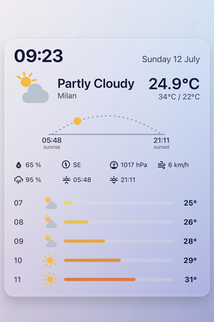
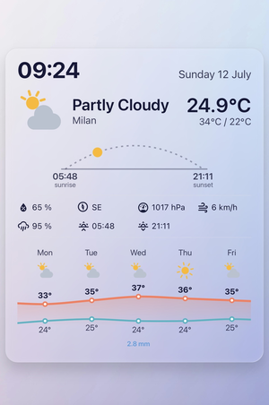
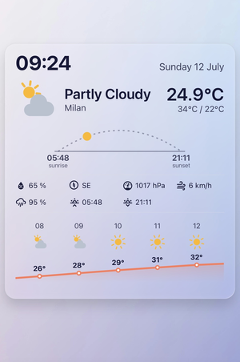
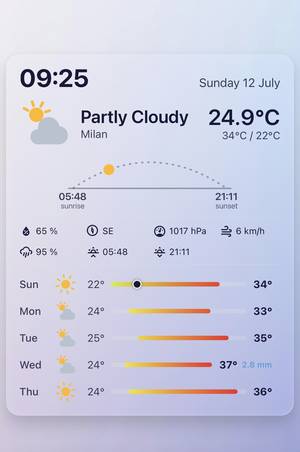
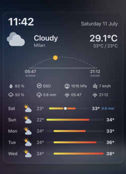

# Sun Weather Card

A weather card for [Home Assistant](https://www.home-assistant.io/) with an animated current‑conditions header, a sunrise/sunset arc, and daily or hourly forecasts shown as iOS‑style bars or a smooth line graph. Fully configurable from the UI editor.

<!--
  SCREENSHOTS
  Main previews (row 1: daily, row 2: hourly) — keep the SAME theme for all four
  so the comparison is about the layout, not the theme. Light theme reads best.
  A light/dark pair is shown further down in the "Themes" section.
-->
<p align="center">
  
  
</p>
<p align="center">
  
  
</p>

---

## Features

- **Current conditions header** – time, date, animated weather icon, current temperature, today's high/low and the location name.
- **Sunrise/sunset arc** – a light dotted arc with the sun (or moon at night) moving along it between sunrise and sunset.
- **Configurable details** – pick which attributes to show below the arc (humidity, pressure, wind, precipitation, UV, sunrise/sunset and more), shown as a tidy grid. Each attribute (humidity, pressure, wind, precipitation, UV index, etc.) is shown only if your weather integration provides it.
- **Daily & hourly forecast** – choose `daily` or `hourly`.
- **Two layouts** – classic **bars** (iOS‑style temperature range bars) or a **graph** (smooth temperature line, with max/min lines for daily).
- **Original animated SVG icons** for sun, moon, clouds, rain, snow, fog, wind and lightning. No external assets.
- **Multi‑language** – card content follows Italian, English, or your Home Assistant system language.
- **Tap / hold / double‑tap actions** – standard Home Assistant actions (more‑info, navigate, url, perform‑action, toggle).
- **UI editor** – configure everything without touching YAML.

---

## Themes

The card automatically follows your Home Assistant theme — light or dark.

<p align="center">
  
  
</p>

---

## Installation

### HACS (recommended)

1. Go to **HACS → Frontend**.
2. Open the menu (⋮) → **Custom repositories**.
3. Add this repository URL and select category **Lovelace / Dashboard**.
4. Install **Sun Weather Card**.
5. Reload your browser (hard refresh).

### Manual

1. Download `sun-weather-card.js` from the latest release.
2. Copy it to `config/www/`.
3. Add it as a dashboard resource:
   - **Settings → Dashboards → ⋮ → Resources → Add resource**
   - URL: `/local/sun-weather-card.js`
   - Type: **JavaScript Module**
4. Reload your browser (hard refresh).

---

## Usage

Add the card from the dashboard card picker (it shows a live preview), or in YAML:

```yaml
type: custom:sun-weather-card
entity: weather.your_weather_entity
```

That's the minimum needed. Everything else is optional and has sensible defaults.

---

## Configuration

All options can be set from the visual editor or in YAML.

| Option | Type | Default | Description |
|---|---|---|---|
| `entity` | string | **required** | Your `weather.*` entity. |
| `sun_entity` | string | `sun.sun` | Sun entity used for the sunrise/sunset arc. |
| `location` | string | *auto* | Location name shown under the condition. Empty = taken automatically. |
| `language` | string | `system` | Card language: `system`, `it` or `en`. |
| `time_format` | string | `24` | `24` or `12` hour clock. |
| `show_time` | boolean | `true` | Show the clock. |
| `show_date` | boolean | `true` | Show the date. |
| `show_arc` | boolean | `true` | Show the sunrise/sunset arc. |
| `forecast_type` | string | `daily` | `daily` or `hourly`. |
| `forecast_layout` | string | `bars` | `bars` or `graph`. |
| `forecast_days` | number | `7` | Number of days to load (daily). |
| `forecast_hours` | number | `24` | Number of hours to load (hourly). |
| `visible_rows` | number | *all* | How many rows/columns stay visible; the rest scrolls. Empty = show all. |
| `show_forecast_precipitation` | boolean | `true` | Show rain (mm) per day when provided. |
| `show_forecast_toggle` | boolean | `false` | Show an in‑card Daily/Hourly toggle. |
| `details` | list | *(none)* | Attributes to show below the arc (see below). |
| `tap_action` | action | `more-info` | Standard HA action. |
| `hold_action` | action | – | Standard HA action. |
| `double_tap_action` | action | – | Standard HA action. |

### Details

Add any of these to the `details` list, in the order you want them shown. An item appears only if your integration provides that value.

`humidity`, `pressure`, `wind_speed`, `wind_bearing`, `precipitation`, `precipitation_probability`, `sunrise`, `sunset`, `visibility`, `apparent_temperature`, `cloud_coverage`, `uv_index`, `dew_point`

---

## Example

```yaml
type: custom:sun-weather-card
entity: weather.home
sun_entity: sun.sun
language: system
time_format: '24'
forecast_type: daily
forecast_layout: graph
forecast_days: 7
visible_rows: 5
show_forecast_precipitation: true
details:
  - humidity
  - wind_bearing
  - pressure
  - wind_speed
  - sunrise
  - sunset
tap_action:
  action: more-info
```

---

## Notes

- The card uses the modern `weather.get_forecasts` service and falls back to the legacy `forecast` attribute when needed.
- Forecast data is cached for a few minutes to avoid excessive calls.
- All weather icons are original SVGs drawn from scratch — no third‑party assets.

---

## License

MIT
